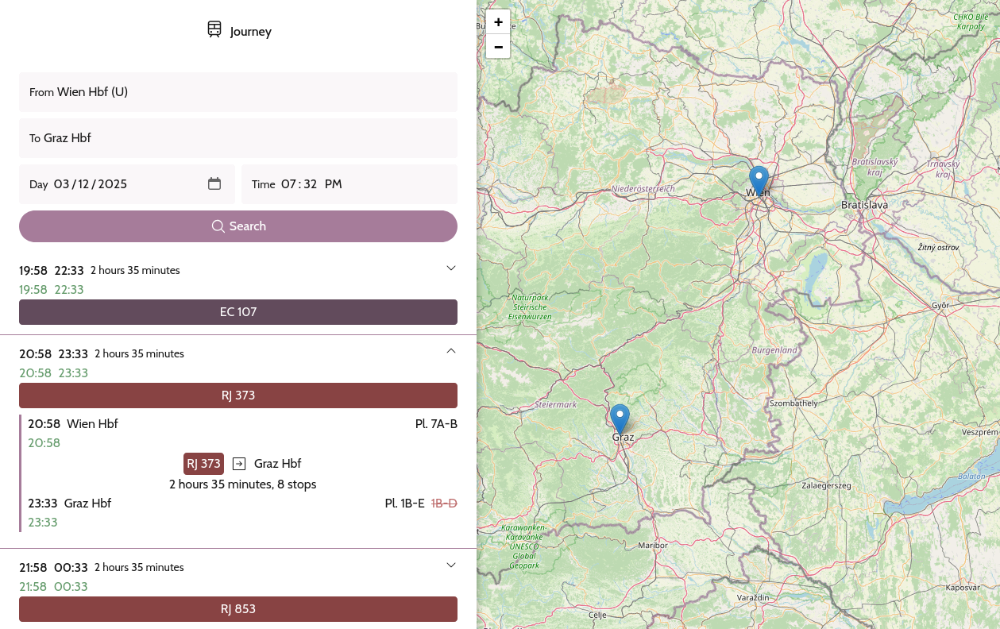

# routecat

A user-friendly web application for finding journeys using the ÖBB Hafas system. It supports basically the entirety of public transport in Austria - trains, trams, buses, etc. It also knows about most trains in other countries in Europe, although live data might not be accurate then.

## Development

> The **pnpm** package manager is recommended to use with this project.

This repository is a monorepo. The frontend is contained in the `packages/web` directory, and backend in `packages/server`. There's also an additional typings package: `packages/types`

### Web

The frontend is written in React and uses Vite.

- Development: `pnpm dev`
- Build: `pnpm build`

### Backend

The backend uses Express.

- Development: `pnpm dev`
- Build: `pnpm build`
